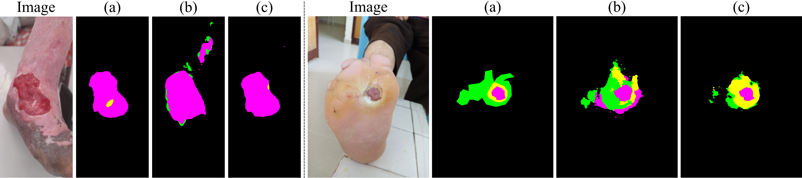

# TiSage Method and Paper Reproduction

This directory contains TiSage, all paper-reported experiment launchers, and
the evidence used to verify the reported results. Commands are run from the
repository root and use portable `torchrun` execution; no scheduler-specific
scripts are required.

## Evaluation Protocol

- Table 1 and Table 2 use the paper-selected validation checkpoint from each linked run. EMA-teacher metrics are used when available; supervised methods use their standard best-validation checkpoint.
- Table 2 reports **DFUTissue Fixed** and **LUTSeg 1/8**.
- The component ablation and sensitivity analysis report best student-model mIoU, matching the paper's ablation protocol.
- The selected paper seeds and all method hyperparameters are encoded in `scripts/run_table1.py`.
- Launchers default to the paper's worker counts: one GPU for DeepLabV3+ and two for all other reported training runs.

## Table 1: Segmentation Results

Each entry is mIoU / Dice (F1 for DFUTissue Fixed). The LUTSeg full-supervision
references are [31.37 / 39.19](logs/table1/dinov2_dpt/lutseg/full/out.log) for
DINOv2–DPT and [22.06 / 25.61](logs/table1/deeplabv3plus/lutseg/full/out.log)
for DeepLabV3+–R50.

| Method | DFUTissue Fixed | DFUTissue 1/4 | DFUTissue 1/8 | DFUTissue 1/16 | LUTSeg 1/4 | LUTSeg 1/8 | LUTSeg 1/16 |
|---|---:|---:|---:|---:|---:|---:|---:|
| DeepLabV3+–R50 | [70.02 / 81.12](logs/table1/deeplabv3plus/dfutissue/fixed/out.log) | [65.22 / 77.14](logs/table1/deeplabv3plus/dfutissue/1_4/out.log) | [58.32 / 70.52](logs/table1/deeplabv3plus/dfutissue/1_8/out.log) | [48.38 / 58.87](logs/table1/deeplabv3plus/dfutissue/1_16/out.log) | [19.89 / 23.17](logs/table1/deeplabv3plus/lutseg/1_4/out.log) | [20.79 / 24.18](logs/table1/deeplabv3plus/lutseg/1_8/out.log) | [21.25 / 25.34](logs/table1/deeplabv3plus/lutseg/1_16/out.log) |
| DINOv2–DPT | [68.71 / 80.21](logs/table1/dinov2_dpt/dfutissue/fixed/out.log) | [66.23 / 78.03](logs/table1/dinov2_dpt/dfutissue/1_4/out.log) | [64.68 / 76.57](logs/table1/dinov2_dpt/dfutissue/1_8/out.log) | [52.83 / 65.02](logs/table1/dinov2_dpt/dfutissue/1_16/out.log) | [29.38 / 35.19](logs/table1/dinov2_dpt/lutseg/1_4/out.log) | [20.47 / 23.55](logs/table1/dinov2_dpt/lutseg/1_8/out.log) | [24.47 / 30.15](logs/table1/dinov2_dpt/lutseg/1_16/out.log) |
| FixMatch | [68.91 / 80.19](logs/table1/fixmatch/dfutissue/fixed/out.log) | [67.17 / 78.80](logs/table1/fixmatch/dfutissue/1_4/out.log) | [66.90 / 78.40](logs/table1/fixmatch/dfutissue/1_8/out.log) | [60.14 / 71.30](logs/table1/fixmatch/dfutissue/1_16/out.log) | [27.70 / 33.00](logs/table1/fixmatch/lutseg/1_4/out.log) | [27.26 / 33.91](logs/table1/fixmatch/lutseg/1_8/out.log) | [27.42 / 34.33](logs/table1/fixmatch/lutseg/1_16/out.log) |
| UniMatch-V2 | [69.94 / 80.96](logs/table1/unimatch_v2/dfutissue/fixed/out.log) | [68.17 / 79.67](logs/table1/unimatch_v2/dfutissue/1_4/out.log) | [67.28 / 78.85](logs/table1/unimatch_v2/dfutissue/1_8/out.log) | [61.80 / 73.24](logs/table1/unimatch_v2/dfutissue/1_16/out.log) | [26.13 / 30.55](logs/table1/unimatch_v2/lutseg/1_4/out.log) | [27.60 / 34.24](logs/table1/unimatch_v2/lutseg/1_8/out.log) | [27.35 / 32.24](logs/table1/unimatch_v2/lutseg/1_16/out.log) |
| **TiSage** | [**72.36 / 83.05**](logs/table1/tisage/dfutissue/fixed/out.log) | [**69.77 / 81.00**](logs/table1/tisage/dfutissue/1_4/out.log) | [**67.93 / 79.28**](logs/table1/tisage/dfutissue/1_8/out.log) | [61.33 / 73.17](logs/table1/tisage/dfutissue/1_16/out.log) | [**28.73 / 34.50**](logs/table1/tisage/lutseg/1_4/out.log) | [**31.70 / 39.25**](logs/table1/tisage/lutseg/1_8/out.log) | [**28.55 / 34.04**](logs/table1/tisage/lutseg/1_16/out.log) |

## Table 2: Per-Class IoU

| Dataset / Method | Bg | Fibrin / Epi | Gran. / Slough | Callus / Gran. | Necr. | Other | mIoU |
|---|---:|---:|---:|---:|---:|---:|---:|
| DFUTissue Fixed — UniMatch-V2 | [88.3](logs/table1/unimatch_v2/dfutissue/fixed/out.log) | [47.3](logs/table1/unimatch_v2/dfutissue/fixed/out.log) | [86.9](logs/table1/unimatch_v2/dfutissue/fixed/out.log) | [57.2](logs/table1/unimatch_v2/dfutissue/fixed/out.log) | — | — | [69.94](logs/table1/unimatch_v2/dfutissue/fixed/out.log) |
| DFUTissue Fixed — **TiSage** | [88.3](logs/table1/tisage/dfutissue/fixed/out.log) | [57.6](logs/table1/tisage/dfutissue/fixed/out.log) | [86.9](logs/table1/tisage/dfutissue/fixed/out.log) | [56.6](logs/table1/tisage/dfutissue/fixed/out.log) | — | — | [72.36](logs/table1/tisage/dfutissue/fixed/out.log) |
| LUTSeg 1/8 — UniMatch-V2 | [94.8](logs/table1/unimatch_v2/lutseg/1_8/out.log) | [25.4](logs/table1/unimatch_v2/lutseg/1_8/out.log) | [5.6](logs/table1/unimatch_v2/lutseg/1_8/out.log) | [39.7](logs/table1/unimatch_v2/lutseg/1_8/out.log) | [0.0](logs/table1/unimatch_v2/lutseg/1_8/out.log) | [0.0](logs/table1/unimatch_v2/lutseg/1_8/out.log) | [27.60](logs/table1/unimatch_v2/lutseg/1_8/out.log) |
| LUTSeg 1/8 — **TiSage** | [95.7](logs/table1/tisage/lutseg/1_8/out.log) | [26.5](logs/table1/tisage/lutseg/1_8/out.log) | [15.4](logs/table1/tisage/lutseg/1_8/out.log) | [52.4](logs/table1/tisage/lutseg/1_8/out.log) | [0.1](logs/table1/tisage/lutseg/1_8/out.log) | [0.0](logs/table1/tisage/lutseg/1_8/out.log) | [31.70](logs/table1/tisage/lutseg/1_8/out.log) |

## Table 3: MedSigLIP Prior-Only Results

| Prior setup | DFUTissue Pixel Acc. | DFUTissue mIoU | LUTSeg Pixel Acc. | LUTSeg mIoU |
|---|---:|---:|---:|---:|
| Zero-shot, single scale | [76.24](logs/table3_prior/single_scale/dfutissue_zeroshot_single_scale.log) | [34.70](logs/table3_prior/single_scale/dfutissue_zeroshot_single_scale.log) | [67.94](logs/table3_prior/single_scale/lutseg_zeroshot_single_scale.log) | [16.39](logs/table3_prior/single_scale/lutseg_zeroshot_single_scale.log) |
| Classifier, single scale | [79.40](logs/table3_prior/single_scale/dfutissue_classifier_single_scale.log) | [45.67](logs/table3_prior/single_scale/dfutissue_classifier_single_scale.log) | [80.06](logs/table3_prior/single_scale/lutseg_classifier_single_scale.log) | [24.02](logs/table3_prior/single_scale/lutseg_classifier_single_scale.log) |
| Classifier, coarse only | [74.71](logs/table3_prior/multiscale/dfutissue_results.tsv) | [44.70](logs/table3_prior/multiscale/dfutissue_results.tsv) | [77.48](logs/table3_prior/multiscale/lutseg_results.tsv) | [23.38](logs/table3_prior/multiscale/lutseg_results.tsv) |
| Classifier, fine only | [81.55](logs/table3_prior/multiscale/dfutissue_results.tsv) | [48.05](logs/table3_prior/multiscale/dfutissue_results.tsv) | [81.00](logs/table3_prior/multiscale/lutseg_results.tsv) | [25.44](logs/table3_prior/multiscale/lutseg_results.tsv) |
| **Classifier, fused** | [**80.92**](logs/table3_prior/multiscale/dfutissue_results.tsv) | [**52.11**](logs/table3_prior/multiscale/dfutissue_results.tsv) | [**81.77**](logs/table3_prior/multiscale/lutseg_results.tsv) | [**26.28**](logs/table3_prior/multiscale/lutseg_results.tsv) |

## Component Ablation

DFUTissue 1/8, mean ± population standard deviation over seeds 0–2, using the
best student-model mIoU from each run.

| Variant | mIoU |
|---|---:|
| TiSage full | [68.10 ± 0.35](logs/component_ablation/dfutissue/1_8/full/) |
| Without multiscale prior | [67.87 ± 0.24](logs/component_ablation/dfutissue/1_8/no_multiscale/) |
| Without adaptive alpha | [67.76 ± 0.87](logs/component_ablation/dfutissue/1_8/no_adaptive_alpha/) |
| Without confidence-weighted KL | [67.50 ± 0.30](logs/component_ablation/dfutissue/1_8/no_confw_kl/) |

## Sensitivity Analysis

LUTSeg 1/8, seed 0, using best student-model mIoU. Gate sensitivity varies by
0.35 mIoU across the reported range; alpha 0.25 gives the best alpha-sweep result.

| Parameter | Value | mIoU | Evidence |
|---|---:|---:|---|
| Gate | 0.80 | 32.22 | [log](logs/sensitivity/lutseg/1_8/mode_gate_gate_conf0.80/out.log) |
| Gate | 0.85 | 32.55 | [log](logs/sensitivity/lutseg/1_8/mode_gate_gate_conf0.85/out.log) |
| Gate | 0.90 | 32.20 | [log](logs/sensitivity/lutseg/1_8/mode_gate_gate_conf0.90/out.log) |
| Gate | 0.95 | 32.45 | [log](logs/sensitivity/lutseg/1_8/mode_gate_gate_conf0.95/out.log) |
| Alpha | 0.10 | 32.50 | [log](logs/sensitivity/lutseg/1_8/mode_alpha_alpha0.10/out.log) |
| Alpha | 0.15 | 32.50 | [log](logs/sensitivity/lutseg/1_8/mode_alpha_alpha0.15/out.log) |
| Alpha | 0.20 | 28.85 | [log](logs/sensitivity/lutseg/1_8/mode_alpha_alpha0.20/out.log) |
| Alpha | **0.25** | **32.84** | [log](logs/sensitivity/lutseg/1_8/mode_alpha_alpha0.25/out.log) |
| Alpha | 0.30 | 32.27 | [log](logs/sensitivity/lutseg/1_8/mode_alpha_alpha0.30/out.log) |

## Running Experiments

Print the exact command for any Table 1 result:

```bash
python method/scripts/run_table1.py \
  --method tisage --dataset lutseg --split 1_8 --dry-run
```

Run the reported ablation and sensitivity configurations:

```bash
python method/scripts/run_component_ablation.py \
  --variant no_confw_kl --seed 0 --dry-run

python method/scripts/run_sensitivity.py \
  --parameter gate --value 0.90 --dry-run
```

The prior-only scripts used for Table 3 are `train_prior_dfutissue.py`,
`train_prior_lutseg.py`, `eval_prior_zeroshot_*.py`, and
`eval_prior_multiscale_*.py` in `scripts/`.

### Bounded Training Check

Run two real TiSage optimizer steps followed by full LUTSeg validation on one
GPU. This uses the same launcher and configuration as the paper, but deliberately
limits the duration and must not be used as a reported result.

```bash
set -o pipefail
SMOKE_DIR="$(mktemp -d /tmp/tisage-train-smoke.XXXXXX)"
python method/scripts/run_table1.py \
  --method tisage --dataset lutseg --split 1_16 \
  --nproc-per-node 1 --epochs 1 --max-steps-per-epoch 2 \
  --save-path "$SMOKE_DIR" \
  2>&1 | tee "$SMOKE_DIR/train.log"
echo "Artifacts: $SMOKE_DIR"
```

The run creates `latest.pth`, `best.pth`, TensorBoard events, and `train.log` in
the printed temporary directory. Add `--no-save` to skip the two large
checkpoints. Full experiments use the same command without the bounded-training
arguments.

### Checkpoint Evaluation

LUTSeg has a patient-disjoint validation set rather than a public test set. Use
the student state, selected by default, to evaluate a checkpoint downloaded from
[ksanchez84/TiSage](https://huggingface.co/ksanchez84/TiSage):

```bash
python method/eval/evaluate_checkpoint.py \
  --config method/configs/tisage_lutseg.yaml \
  --checkpoint path/to/lutseg_tisage_1_8_seed0_best.pth \
  --output /tmp/tisage-lutseg-evaluation.json
```

The command reports per-class IoU and Dice, mean IoU, and mean Dice over all 30
validation images and requires one CUDA GPU. It evaluates the released
best-student snapshot by default; pass `--state model_ema` for its contemporaneous
teacher state. To validate checkpoint compatibility without a GPU, append
`--check-only`.

The released `best.pth` files were selected by best student validation mIoU and
include the EMA state from the same epoch. The Table 1 numbers are selected
best-EMA values across training and are verified from the committed logs; an
individual released snapshot can therefore differ from the Table 1 value.

## Verification

```bash
python method/eval/verify_reported_results.py
```

The verifier extracts Tables 1–3, the component ablation, and the sensitivity
study directly from the committed evidence and exits nonzero on a mismatch.

## Figure 4



The two cases were selected deterministically as the maximum focus-class gain
and a hard case. Their paths and scores are in `figures/figure4_cases.tsv`.
After downloading the two LUTSeg segmentation checkpoints, reproduce the grid:

```bash
python method/scripts/generate_figure4.py \
  --data-root data/LUTSeg \
  --baseline-checkpoint method/checkpoints/downloaded/lutseg_unimatch_v2_1_8_seed0_best.pth \
  --tisage-checkpoint method/checkpoints/downloaded/lutseg_tisage_1_8_seed0_best.pth
```
